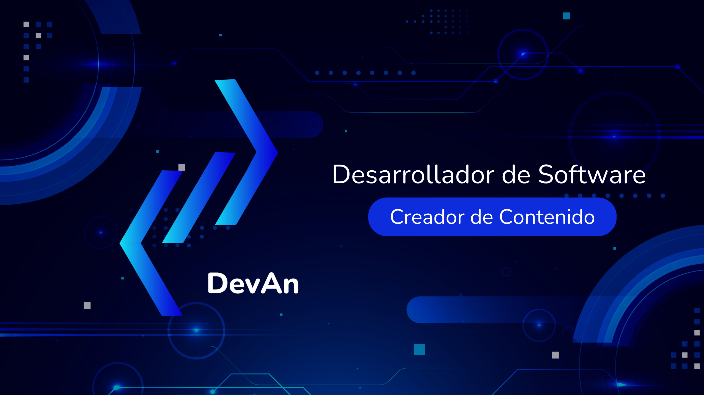

<h1 align="center">¡Hola! Soy Ángel, pero me conocen como <a href="#">DevAn</a> 👋</h1>

 

 

<h2>💡 Acerca de mí:</h2> 

Soy un desarrollador Junior con una gran pasión por la programación y un fuerte deseo de aprender y crecer en este emocionante campo. Mi objetivo es dejar mi marca personal en cada proyecto, reflejando mi filosofía:

<h3 align="center">"Donde la creatividad cobra vida"</h3>

### 🌐 Especialización
Me especializo en el desarrollo web, creando aplicaciones eficientes y funcionales que brindan experiencias únicas a los usuarios. Mi enfoque es combinar la lógica de programación con un toque creativo para lograr resultados sobresalientes.

### 🚀 ¿Por qué yo?
Siempre estoy abierto a colaborar, aprender de otros y enfrentar nuevos desafíos. Si buscas a alguien con entusiasmo, motivación y la disposición para contribuir en tus proyectos, ¡estoy aquí para hacer que suceda!

# 💻 Tech Stack:
                              

### ⚙️ &nbsp;GitHub Analytics

## Hi there 👋

<!--
**DevAn-Projects/DevAn-Projects** is a ✨ _special_ ✨ repository because its `README.md` (this file) appears on your GitHub profile.

Here are some ideas to get you started:

- 🔭 I’m currently working on ...
- 🌱 I’m currently learning ...
- 👯 I’m looking to collaborate on ...
- 🤔 I’m looking for help with ...
- 💬 Ask me about ...
- 📫 How to reach me: ...
- 😄 Pronouns: ...
- ⚡ Fun fact: ...
-->
